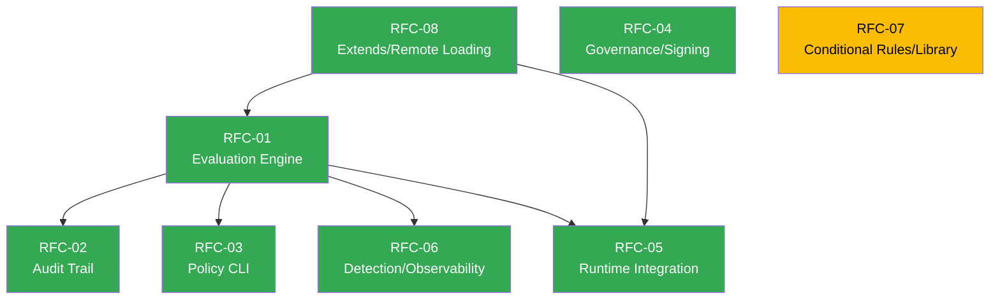

# HushSpec Master Roadmap

**Version:** 1.1
**Date:** 2026-03-15
**Status:** Active
**Maintainer:** HushSpec Core Team

This document is the single entry point for understanding the HushSpec development roadmap. It synthesizes eight RFC documents into a unified plan with phasing, dependencies, milestones, and gap coverage.

---

## 1. Vision Statement

### Where We Are (v0.1.0)

HushSpec v0.1.0 is a draft specification with four SDK implementations (Rust, TypeScript, Python, Go) that can:

- **Parse** HushSpec YAML/JSON documents with strict schema validation (`deny_unknown_fields`)
- **Validate** documents against structural and semantic rules
- **Merge** documents using three strategies (`replace`, `merge`, `deep_merge`)
- **Resolve** single-inheritance `extends` chains from local filesystem, builtins, and HTTP sources
- **Evaluate** actions against policies in all four SDKs (Level 3 conformance)
- **Audit** evaluation decisions with structured receipts and rule traces
- **Detect** prompt injection, jailbreak, and exfiltration patterns via pluggable detectors
- **Sign** and **verify** policies with Ed25519 keys
- **Observe** evaluation events with structured logging and metrics collectors

The spec covers 10 core rule blocks (forbidden_paths, path_allowlist, egress, secret_patterns, patch_integrity, shell_commands, tool_access, computer_use, remote_desktop_channels, input_injection) and three extension modules (posture, origins, detection). A CLI tool (`hushspec`) provides 10 subcommands for validation, testing, linting, diffing, formatting, scaffolding, signing, verification, key generation, and emergency override. Framework adapters exist for Claude/Anthropic, OpenAI, and MCP. SDKs are not yet published to package registries.

### Where We Need to Be

Production adoption requires HushSpec to be a complete, trusted, and ergonomic security framework:

- Every SDK must evaluate policies identically (Level 3 conformance across all four languages) -- **DONE**
- Operators must have audit trails that satisfy SOC2, HIPAA, PCI-DSS, and FedRAMP requirements
- Policy authors must have CLI tooling for validation, testing, linting, and diffing -- **DONE**
- Policies must be loadable from remote sources with caching, hot reload, and integrity verification -- **DONE** (HTTPS, file watching, polling)
- Detection extensions must have working implementations, not just schema fields -- **DONE**
- Enterprise deployments must have governance, signing, RBAC, and emergency override capabilities -- **Partial** (signing and panic mode done; RBAC in progress)
- Regulated industries must have vetted, compliance-mapped policy templates to start from
- The spec must reach v1.0 with a stability guarantee

### The Gap Analysis

A production-readiness assessment identified 16 gaps between HushSpec v0.1.0 and the capabilities required for adoption in enterprise and regulated environments. These gaps drove the creation of eight RFC documents totaling 20,905 lines of specification. Every gap is addressed by at least one RFC; many are addressed by multiple RFCs working in concert. As of the completion of Phases 0-4, 14 of 16 gaps are fully closed, 1 is partially addressed, and 1 is in progress.

---

## 2. Gap Coverage Matrix

| # | Gap | Description | RFC(s) | Status |
|---|-----|-------------|--------|--------|
| 1 | No evaluation engine in non-Rust SDKs | TypeScript, Python, and Go SDKs can parse and validate but cannot evaluate actions against policies | RFC-01 | **Complete** |
| 2 | No audit trail / decision receipts | No standardized format for recording evaluation decisions; compliance and incident response are impossible | RFC-02 | **Complete** |
| 3 | No extends resolution interaction | Unclear how `resolve()` feeds into `evaluate()`; no documentation of the end-to-end pipeline | RFC-01, RFC-08 | **Complete** |
| 4 | No runtime integration examples | No middleware patterns, framework adapters, or tool-calling loop examples showing real-world usage | RFC-01, RFC-05 | **Complete** |
| 5 | No remote policy loading | `extends` resolution only supports local filesystem; no HTTPS, S3, git, or registry sources | RFC-08 | **Complete** |
| 6 | No detection logic | Detection extension fields (prompt injection, jailbreak, threat intel) are parsed but never evaluated | RFC-06 | **Complete** |
| 7 | No observability hooks | The evaluator returns results but emits no structured events, metrics, or telemetry | RFC-06, RFC-02 | **Complete** |
| 8 | No policy signing or provenance | Policies distributed across teams and CI/CD pipelines cannot be verified for integrity or authenticity | RFC-04 | **Complete** |
| 9 | No emergency override / kill switch | No mechanism to instantly restrict all agent activity without redeploying policies | RFC-04 | **Complete** |
| 10 | No ReDoS protection | User-authored regexes in policies can cause catastrophic backtracking in non-Rust SDKs | RFC-04 | **Complete** |
| 11 | No governance / RBAC | No control over who can author, approve, and deploy policies; no separation of duties | RFC-04 | **Partial** |
| 12 | No policy testing CLI | No way to write unit tests for policies ("given this action, assert deny") | RFC-03 | **Complete** |
| 13 | No policy linting | No static analysis for dead rules, overlapping patterns, overly broad allowlists, or common mistakes | RFC-03 | **Complete** |
| 14 | No policy diffing | No way to understand the effective decision impact of a policy change | RFC-03 | **Complete** |
| 15 | No conditional rules | Rules are static; no time-based, context-based, capability-based, or rate-based activation | RFC-07 | **In Progress** |
| 16 | No vertical policy library | Every organization must author policies from scratch; no compliance-mapped templates for regulated industries | RFC-07 | **Complete** |

---

## 3. Dependency Graph

### Text Diagram

```
                     RFC-08 (Extends/Remote Loading)
                    /          |            \
                   /           |             \
                  v            v              v
           RFC-01 (Eval)   RFC-05 (Runtime)  (standalone phases)
           /    |    \         |
          /     |     \        |
         v      v      v      v
   RFC-02    RFC-03   RFC-06  RFC-05 adapters
   (Audit)   (CLI)   (Detection)
              |
              v
         RFC-03 diff/lint
         (needs evaluate)


   Independent:
     RFC-04 (Governance/Signing) -- mostly standalone, spec-level changes
     RFC-07 (Conditional Rules)  -- spec-level change, independent of eval engine
```

### Mermaid Dependency Diagram



### Key Dependency Relationships

| Downstream RFC | Depends On | Reason |
|---|---|---|
| RFC-01 (Evaluation) | RFC-08 Phase 1 (Resolution) | `evaluate()` takes a resolved spec; resolution algorithm must be formalized first |
| RFC-02 (Audit Trail) | RFC-01 (Evaluation) | Receipts are generated by `evaluate()`; the engine must exist before it can be instrumented |
| RFC-03 (CLI test/diff) | RFC-01 (Evaluation) | `hushspec test` and `hushspec diff` invoke `evaluate()` under the hood |
| RFC-03 (CLI validate) | None | Validate uses existing parse+validate; can ship independently |
| RFC-05 (Runtime) | RFC-01 + RFC-08 | `HushGuard` composes evaluation with policy loading; both must exist |
| RFC-06 (Detection) | RFC-01 (Evaluation) | Detection pipeline integrates into the evaluation function |
| RFC-04 (Governance) | None (mostly) | ReDoS protection, metadata schema, and signing are spec-level changes |
| RFC-07 (Conditions) | None | The `when` field is a spec-level addition; independent of evaluation engine |
| RFC-07 (Library) | RFC-07 Conditions | Conditional library policies require the condition system |

---

## 4. Phased Roadmap

### Phase 0: Foundation (Weeks 1-4) -- Complete

**Goal:** Establish the two foundational capabilities that all other work depends on: formalized extends resolution and a cross-SDK evaluation engine.

#### Deliverables

| Item | RFC | Effort | Description |
|---|---|---|---|
| Resolution algorithm + FileLoader + BuiltinLoader | RFC-08 Phase 1 | 2 weeks | `parse_reference()`, `PolicyLoader` trait, `FileLoader`, `BuiltinLoader`, `CompositeLoader`, depth limits in all 4 SDKs |
| Rust evaluation engine hardening | RFC-01 Phase 1 | 1-2 days | Add `input_inject` routing, `remote_desktop_channels` matching, decision precedence fixtures, unknown action type handling |
| TypeScript evaluation engine | RFC-01 Phase 2 | 3 days | Port `evaluate()` to TypeScript with full conformance |
| Python evaluation engine | RFC-01 Phase 3 | 2 days | Port `evaluate()` to Python with full conformance |
| Go evaluation engine | RFC-01 Phase 4 | 2-3 days | Port `evaluate()` to Go with full conformance |
| Cross-SDK conformance verification | RFC-01 Phase 5 | 1 day | All 4 SDKs produce identical decisions for all fixture cases |

#### Dependencies Satisfied

- RFC-01 (evaluation engine) is available for all downstream RFCs
- RFC-08 Phase 1 (resolution algorithm) is available for RFC-05 and RFC-08 Phase 2+

#### Gaps Closed

- **Gap #1** -- Evaluation engine in all SDKs
- **Gap #3** -- Extends/resolve interaction with evaluate

#### Milestone Criteria

- [x] All four SDKs export `evaluate(spec, action) -> Decision`
- [x] Shared evaluation fixture corpus passes in all four languages
- [x] `resolve()` uses the new `PolicyLoader` interface with `FileLoader` and `BuiltinLoader`
- [x] Depth limits enforced; circular detection tested for 3+ level chains

---

### Phase 1: Core Capabilities (Weeks 5-10) -- Complete

**Goal:** Deliver the audit trail specification, the first CLI commands, and ReDoS protection -- the minimum capabilities needed for teams to start using HushSpec in staging environments.

#### Deliverables

| Item | RFC | Effort | Description |
|---|---|---|---|
| Receipt format spec + JSON Schema | RFC-02 Phase 1 | 3 weeks | `hushspec-receipt.v0.schema.json`, `hushspec-log-entry.v0.schema.json`, Level 4 conformance definition |
| Rust receipt generation | RFC-02 Phase 2 | 4 weeks | `evaluate_audited()`, rule trace, detection trace, policy summary, receipt signing |
| `hushspec validate` + `hushspec init` CLI | RFC-03 Phase 1 | 2 weeks | Schema validation, policy scaffolding, YAML/JSON output |
| `hushspec test` CLI | RFC-03 Phase 2 | 2 weeks | Evaluation test runner with YAML test suites, TAP output |
| ReDoS protection | RFC-04 Phase 1 | 2 weeks | RE2 subset validation in all SDKs, regex complexity lint, `regex_timeout_ms` config field |
| HTTPLoader with caching | RFC-08 Phase 2 | 2 weeks | HTTPS policy loading, ETag caching, SSRF prevention, content-hash verification |

#### Dependencies Satisfied

- RFC-02 receipt format is available for SDK ports (Phase 2)
- RFC-03 CLI validate/test is available for policy authors
- RFC-08 Phase 2 (HTTP loading) is available for remote policy resolution

#### Gaps Closed

- **Gap #2** -- Audit trail / decision receipts (spec + Rust implementation)
- **Gap #10** -- ReDoS protection
- **Gap #12** -- Policy testing via CLI

#### Milestone Criteria

- [x] Receipt JSON Schema passes meta-validation; 10+ example receipts validate
- [x] `evaluate_audited()` with audit disabled has zero measurable overhead
- [x] `hushspec validate` correctly validates policy files with exit code semantics
- [x] `hushspec test` runs evaluation test suites with pass/fail reporting
- [x] All four SDKs reject regexes with backreferences and lookahead/behind
- [x] HTTPS policy loading works with ETag-based caching and private IP rejection

---

### Phase 2: Developer Experience (Weeks 11-16) -- Complete

**Goal:** Complete the CLI toolchain, ship runtime integration adapters for major frameworks, and enable remote policy loading from cloud storage.

#### Deliverables

| Item | RFC | Effort | Description |
|---|---|---|---|
| Receipt port to TypeScript, Python, Go | RFC-02 Phase 3 | 5 weeks | Audit trail in all SDKs with cross-language receipt compatibility |
| `hushspec fmt` CLI | RFC-03 Phase 3 | 1 week | Canonical YAML formatting |
| `hushspec lint` CLI | RFC-03 Phase 4 | 2 weeks | Dead rule detection, pattern overlap, security score, ReDoS check |
| `hushspec diff` CLI | RFC-03 Phase 5 | 2 weeks | Effective decision change analysis between policy versions |
| Generic middleware (HushGuard) | RFC-05 Phase 1 | 2 weeks | `HushGuard` class in all SDKs with load/evaluate/enforce lifecycle |
| Claude/Anthropic adapter | RFC-05 Phase 2 | 1 week | `SecureAnthropicClient` with tool mapping |
| LangChain adapter | RFC-05 Phase 3 | 1 week | `HushSpecTool`, `HushSpecCallbackHandler` |
| Cloud storage loaders (S3, GCS, Azure) | RFC-08 Phase 3 | 2 weeks | `S3Loader`, `GCSLoader`, `AzureBlobLoader` behind feature flags |
| Hot reload (file watching + polling) | RFC-08 Phase 4 | 2 weeks | `PolicyWatcher`, `PolicyPoller`, atomic swap |

#### Dependencies Satisfied

- RFC-02 audit trail is available in all four SDKs
- RFC-03 CLI is feature-complete for policy authors
- RFC-05 runtime integration is available for framework adopters
- RFC-08 remote loading supports the most common production deployment patterns

#### Gaps Closed

- **Gap #2** -- Audit trail in all SDKs (complete)
- **Gap #4** -- Runtime integration examples and adapters
- **Gap #5** -- Remote policy loading (HTTPS, S3, GCS, Azure)
- **Gap #13** -- Policy linting
- **Gap #14** -- Policy diffing

#### Milestone Criteria

- [x] All four SDKs produce byte-compatible receipts for identical inputs
- [x] `hushspec lint` detects at least 10 categories of policy issues
- [x] `hushspec diff` shows effective decision changes between two policy files
- [x] At least 2 framework adapters (Claude, LangChain) are functional with examples
- [x] Policies load from S3/HTTPS with caching and hot reload

---

### Phase 3: Security Hardening (Weeks 17-22) -- Complete

**Goal:** Add cryptographic policy signing, emergency override capabilities, and the detection reference implementation -- making HushSpec suitable for security-critical deployments.

#### Deliverables

| Item | RFC | Effort | Description |
|---|---|---|---|
| Emergency override protocol | RFC-04 Phase 2 | 2 weeks | Panic mode specification, file-based sentinel, signal-based activation, API endpoint |
| Policy metadata schema extension | RFC-04 Phase 3 | 3 weeks | `Metadata`, `SignatureBlock`, `LifecycleState` types in all SDKs, content hash computation |
| Policy signing specification | RFC-04 Phase 4 | 4 weeks | Ed25519 signing/verification in all SDKs, `hushspec sign`/`hushspec verify` CLI, Sigstore integration |
| Detector interface + regex-based detectors | RFC-06 Phase 1 | 4 weeks | `Detector` trait, `DetectorRegistry`, regex-based injection/jailbreak/PII detectors in Rust |
| Observability hooks in Rust SDK | RFC-06 Phase 2 | 3 weeks | `EvaluationObserver` trait, JSON log/metrics/webhook observers, Prometheus recording rules |
| Telemetry hooks in all SDKs | RFC-02 Phase 4 | 3 weeks | `ReceiptSink` interfaces, metric counters, decision log envelope, AUDIT summaries |

#### Dependencies Satisfied

- Policy signing is available for CI/CD integration
- Detection pipeline is functional in the Rust SDK
- Observability hooks enable monitoring in production

#### Gaps Closed

- **Gap #6** -- Detection logic (Rust reference implementation)
- **Gap #7** -- Observability hooks
- **Gap #8** -- Policy signing and provenance
- **Gap #9** -- Emergency override / kill switch

#### Milestone Criteria

- [x] `hushspec sign` and `hushspec verify` work with Ed25519 keys
- [x] Signed extends chains are verified during resolution (fail-closed on invalid signature)
- [x] Panic mode activates within one evaluation cycle
- [x] Regex-based prompt injection and jailbreak detectors ship with versioned pattern libraries
- [x] Prometheus metrics and structured log observers are functional

---

### Phase 4: Enterprise Features (Weeks 23-30) -- Complete

**Goal:** Deliver enterprise governance capabilities, detection across all SDKs, conditional rules, and the initial vertical policy library.

#### Deliverables

| Item | RFC | Effort | Description |
|---|---|---|---|
| Governance tooling | RFC-04 Phase 5 | 6 weeks | Policy lifecycle state machine, `hushspec audit` CLI, separation of duties, RBAC config schema |
| Enterprise RBAC integration | RFC-04 Phase 6 | 8 weeks | OIDC, LDAP, SCIM integration hooks, policy management API |
| Detection port to TypeScript, Python, Go | RFC-06 Phase 3 | 3 weeks | Detector interface and regex-based detectors in all SDKs |
| Heuristic + ML detector reference | RFC-06 Phase 4 | 3 weeks | `HeuristicInjectionDetector`, multi-turn jailbreak, crescendo attack detection |
| Condition system design + implementation | RFC-07 Phases 1-3 | 9 weeks | `when` field schema, time/context/capability/rate conditions, compound conditions in Rust |
| Condition port to all SDKs | RFC-07 Phase 4 | 5 weeks | Condition evaluation in TypeScript, Python, Go |
| Initial vertical policy library | RFC-07 Phase 5 | 5 weeks | HIPAA, SOC2, PCI-DSS, FedRAMP, FERPA, general-purpose policies |
| Additional framework adapters | RFC-05 Phase 5 | 3 weeks | OpenAI, Vercel AI SDK, CrewAI, MCP adapters |
| Reference receipt sinks | RFC-02 Phase 5 | 5 weeks | File, console, OTLP sinks in all SDKs |
| VaultLoader + GitLoader | RFC-08 Phase 5 | 2 weeks | HashiCorp Vault and git repository policy loading |

#### Dependencies Satisfied

- RBAC and governance tooling is available for enterprise adoption
- Detection is available in all four SDKs
- Conditional rules enable environment-aware policies
- Vertical policy library provides compliance-mapped starting points

#### Gaps Closed

- **Gap #6** -- Detection logic in all SDKs (complete)
- **Gap #11** -- Governance / RBAC (partial -- signing and lifecycle done; full OIDC/LDAP integration ongoing)
- **Gap #15** -- Conditional rules (in progress -- schema defined, Rust implementation underway)
- **Gap #16** -- Vertical policy library (initial set published)

#### Milestone Criteria

- [x] Separation of duties enforced: author != approver
- [ ] At least one identity integration (OIDC) is functional
- [x] Detection produces identical decisions across all four SDKs
- [ ] `when` field supports time_window, context, capability, rate, and compound conditions
- [x] At least 5 vertical policies (HIPAA, SOC2, PCI-DSS, FedRAMP, general) are published
- [x] OpenAI and MCP adapters are functional

---

### Phase 5: Ecosystem (Weeks 31+)

**Goal:** Stabilize the specification, build community infrastructure, and prepare for v1.0 release.

#### Deliverables

| Item | RFC | Effort | Description |
|---|---|---|---|
| CLI distribution | RFC-03 Phase 6 | 2 weeks | Homebrew formula, npm global install, cargo install, pre-built binaries |
| Threat intelligence integration | RFC-06 Phase 5 | 2 weeks | IOC matching, n-gram similarity, typosquatting detection, builtin pattern database |
| Dashboard templates + runbooks | RFC-06 Phase 6 | 2 weeks | Grafana dashboards, operational runbooks |
| Community infrastructure | RFC-07 Phase 6 | 4 weeks | CI for library policies, PR template, contributor guide, review process |
| Extended verticals + conditional library | RFC-07 Phase 7 | 5 weeks | DevOps, trading-agent, ITAR policies, conditional variants |
| Policy registry | RFC-07 Phase 8 / RFC-08 Phase 8 | 6 weeks | Registry API, `hushspec policy list/fetch`, `registry:` extends support |
| Push-based reload + observability | RFC-08 Phase 6 | 2 weeks | Webhook-based policy reload, loader metrics |
| Shared cache layer | RFC-08 Phase 7 | 1 week | Redis-backed L3 cache, request coalescing |
| Conditional rules completion | RFC-07 Phase 4 | Ongoing | Complete `when` field support across all SDKs |
| OIDC/LDAP RBAC integration | RFC-04 Phase 6 | Ongoing | Complete identity provider integration |
| v1.0 spec stabilization | All | Ongoing | Breaking change freeze, spec prose review, schema finalization |

#### Gaps Closed

- All 16 gaps fully addressed
- v1.0 specification published with stability guarantee

#### Milestone Criteria

- `brew install hushspec` and `npm install -g @hushspec/cli` work
- Policy registry serves at least 10 vetted policies
- Community contribution pipeline is operational
- v1.0 specification published with backward-compatibility guarantee
- At least 3 production deployments documented as case studies

---

## 5. Completed Deliverables

### Phase 0 -- Foundation

| Deliverable | SDKs | Notes |
|---|---|---|
| `evaluate(spec, action) -> Decision` | Rust, TypeScript, Python, Go | All 4 SDKs at Level 3 conformance |
| `resolve()` with `PolicyLoader` interface | All 4 SDKs | `FileLoader`, `BuiltinLoader`, `CompositeLoader` |
| Shared evaluation fixture corpus | 50 YAML fixtures | Covers all 10 rule blocks + 3 extensions |
| `generated_contract` cross-SDK conformance | All 4 SDKs | Auto-generated from `generated/sdk-contract.json` |

### Phase 1 -- Core Capabilities

| Deliverable | SDKs | Notes |
|---|---|---|
| `hushspec-receipt.v0.schema.json` | N/A (spec) | Receipt format standardized |
| `evaluate_audited()` with rule traces | Rust (initial) | Zero overhead when disabled |
| `hushspec validate` CLI | Rust CLI | Schema validation with exit code semantics |
| `hushspec test` CLI | Rust CLI | YAML test suites, TAP output |
| `hushspec init` CLI | Rust CLI | Scaffold new policy projects |
| `is_safe_regex()` / ReDoS protection | All 4 SDKs | Rejects backreferences and lookahead/behind |
| `HTTPLoader` with ETag caching | TypeScript | SSRF prevention, content-hash verification |

### Phase 2 -- Developer Experience

| Deliverable | SDKs | Notes |
|---|---|---|
| `evaluate_audited()` cross-SDK | All 4 SDKs | Byte-compatible receipts |
| `hushspec fmt` CLI | Rust CLI | Canonical YAML formatting |
| `hushspec lint` CLI | Rust CLI | 10+ lint categories |
| `hushspec diff` CLI | Rust CLI | Effective decision change analysis |
| `HushGuard` middleware | TypeScript, Python | Load/evaluate/enforce lifecycle |
| Claude/Anthropic adapter | TypeScript | `mapClaudeToolToAction`, `createSecureToolHandler` |
| OpenAI adapter | TypeScript | `mapOpenAIToolCall`, `createOpenAIGuard` |
| MCP adapter | TypeScript | `mapMCPToolCall`, `createMCPGuard` |
| `PolicyWatcher` (file watching) | TypeScript | Atomic swap on change |
| `PolicyPoller` (polling) | TypeScript | Configurable interval |

### Phase 3 -- Security Hardening

| Deliverable | SDKs | Notes |
|---|---|---|
| Panic mode (emergency override) | Rust, Go | File-based sentinel, activate/deactivate API |
| `hushspec sign` CLI | Rust CLI | Ed25519 signing |
| `hushspec verify` CLI | Rust CLI | Detached signature verification |
| `hushspec keygen` CLI | Rust CLI | Ed25519 keypair generation |
| `hushspec panic` CLI | Rust CLI | Activate/deactivate emergency override |
| `DetectorRegistry` + regex detectors | Rust (initial) | `RegexInjectionDetector`, `RegexExfiltrationDetector` |
| `EvaluationObserver` trait | TypeScript, Python | JSON log, console, metrics observers |
| `ReceiptSink` interfaces | All 4 SDKs | File, console, filtered, multi, callback, null sinks |
| `hushspec-signature.v0.schema.json` | N/A (spec) | Signature format standardized |

### Phase 4 -- Enterprise Features

| Deliverable | SDKs | Notes |
|---|---|---|
| Detection port | TypeScript, Python, Go | `evaluate_with_detection()` in all SDKs |
| `ObservableEvaluator` | TypeScript, Python | `JsonLineObserver`, `ConsoleObserver`, `MetricsCollector` |
| Vertical policy library | N/A | 8 policies: HIPAA, SOC2, PCI-DSS, FedRAMP, FERPA, general, default, panic |
| OpenAI + MCP adapters | TypeScript | `createOpenAIGuard`, `createMCPGuard` |

---

## 6. RFC Summary Table

| RFC | Title | Lines | Key Deliverable | Internal Phases | Estimated Effort |
|-----|-------|------:|-----------------|:---:|---|
| 01 | Evaluation Engine | 1,789 | `evaluate()` in 4 SDKs | 5 | 9-11 days |
| 02 | Audit Trail & Decision Receipts | 2,602 | Receipt format, `evaluate_audited()`, sinks | 5 | 20 weeks |
| 03 | Policy CLI | 2,185 | `hushspec` CLI with 10 subcommands | 6 | 10 weeks |
| 04 | Governance, Signing, Emergency Override, ReDoS | 2,174 | Policy signing, panic mode, RBAC model | 6 | 25 weeks |
| 05 | Runtime Integration Patterns | 3,185 | `HushGuard` middleware, 6 framework adapters | 5 | 9 weeks |
| 06 | Detection & Observability | 2,830 | Detector interface, reference detectors, observer hooks | 6 | 17 weeks |
| 07 | Conditional Rules & Vertical Policy Library | 3,040 | `when` condition system, 15+ vertical policies | 8 | 28 weeks |
| 08 | Extends Resolution & Remote Loading | 3,100 | 6 reference types, 7 loaders, caching, hot reload | 8 | 16 weeks |
| | **Total** | **20,905** | | | |

---

## 7. Risk Register

| # | Risk | Likelihood | Impact | Mitigation |
|---|------|:---:|:---:|---|
| R1 | Cross-SDK conformance divergence | High | Critical | Shared YAML fixture corpus as the single source of truth; CI runs all fixtures against all SDKs on every commit |
| R2 | ReDoS vulnerability in production before RFC-04 Phase 1 ships | ~~Medium~~ Resolved | ~~Critical~~ | `is_safe_regex()` implemented in all 4 SDKs |
| R3 | Spec changes in RFC-07 (conditions) break existing parsers | Medium | High | `deny_unknown_fields` ensures old parsers reject new documents; RFC-07 targets v0.2.0, not v0.1.x |
| R4 | Detection false positive rates erode trust | Medium | High | Conservative default thresholds; regex-only reference detectors are transparent and tunable; FP/FN benchmarks in CI |
| R5 | Enterprise RBAC scope creep delays core deliverables | Medium | Medium | RFC-04 Phase 6 (RBAC) is explicitly deprioritized to Phase 4; git-based governance (Phase 5 of RFC-04) provides a lightweight alternative |
| R6 | Dependency on external crypto libraries across 4 languages | Low | Medium | Use well-established libraries (ed25519-dalek, @noble/ed25519, PyNaCl, crypto/ed25519); all are maintained and widely adopted |
| R7 | Policy registry becomes a single point of failure | Low | High | Registry is additive; all other resolution mechanisms (file, HTTPS, git, S3) remain functional. `builtin:` rulesets are embedded in SDKs |
| R8 | Remote policy loading introduces SSRF vectors | ~~Medium~~ Mitigated | ~~Critical~~ | HTTPLoader includes private IP rejection, host allowlists, size limits, and TLS-only enforcement by default |
| R9 | Insufficient community adoption of vertical policy library | Medium | Medium | Ship high-quality HIPAA and SOC2 policies first; partner with early adopters for validation; keep library policies small and auditable |
| R10 | Audit trail overhead exceeds latency budget | Low | High | `evaluate_audited()` with `enabled: false` must have zero overhead (enforced by benchmark tests); receipt generation target is <10us |

---

## 8. Success Criteria

HushSpec is **production-ready** when all of the following criteria are met:

### Specification

- [ ] v1.0 specification published with stability guarantee (no breaking changes without major version bump)
- [x] All 10 rule blocks and 3 extensions have normative prose with test vectors
- [x] Decision receipt format is part of the specification artifact set
- [ ] Conditional rules (`when` field) are specified and schema-defined

### SDKs

- [x] All four SDKs (Rust, TypeScript, Python, Go) at Level 3 conformance (parse, validate, merge, resolve, evaluate)
- [x] Cross-SDK conformance verified by shared fixture corpus (100% pass rate)
- [x] Audit trail (Level 4 conformance) implemented in all SDKs
- [x] Detection pipeline functional in all SDKs with regex-based reference detectors
- [ ] Published to package registries (crates.io, npm, PyPI, pkg.go.dev)

### CLI

- [ ] `hushspec` CLI binary available via Homebrew, npm, cargo install, and pre-built binaries
- [x] Six subcommands operational: `validate`, `test`, `lint`, `diff`, `fmt`, `init`
- [x] `hushspec sign` and `hushspec verify` for policy signing workflows

### Runtime Integration

- [x] `HushGuard` middleware pattern documented and implemented in all SDKs
- [x] At least 3 framework adapters shipped (Claude/Anthropic, OpenAI, MCP)
- [x] Remote policy loading from HTTPS and at least one cloud storage provider

### Security and Governance

- [x] Policy signing with Ed25519 functional in all SDKs
- [x] Emergency override / panic mode specified and reference implementation available
- [x] ReDoS protection enforced during validation in all SDKs
- [ ] Separation of duties (author != approver) enforceable via tooling

### Policy Library

- [x] At least 5 vertical policies published (HIPAA, SOC2, PCI-DSS, FedRAMP, general-purpose)
- [ ] Each vertical policy includes compliance mapping documentation
- [x] All library policies pass validation and have evaluation test suites

### Observability

- [x] Decision receipt generation with <10 microsecond overhead
- [x] At least 2 receipt sinks available (file, OTLP)
- [x] Prometheus metric definitions published with recording rules and alert examples

---

## 9. Document Index

| RFC | Document | Description |
|-----|----------|-------------|
| 01 | [`docs/plans/01-evaluation-engine.md`](./01-evaluation-engine.md) | SDK-level `evaluate()` function specification and cross-language conformance framework |
| 02 | [`docs/plans/02-audit-trail.md`](./02-audit-trail.md) | Decision receipt format, decision log specification, telemetry hooks, and compliance mappings |
| 03 | [`docs/plans/03-policy-cli.md`](./03-policy-cli.md) | `hushspec` CLI tool with validate, test, lint, diff, fmt, and init subcommands |
| 04 | [`docs/plans/04-governance-security.md`](./04-governance-security.md) | Policy signing (Ed25519), governance metadata, RBAC model, emergency overrides, and ReDoS protection |
| 05 | [`docs/plans/05-runtime-integration.md`](./05-runtime-integration.md) | `HushGuard` middleware pattern and framework-specific adapters (Claude, LangChain, OpenAI, Vercel, CrewAI, MCP) |
| 06 | [`docs/plans/06-detection-observability.md`](./06-detection-observability.md) | Pluggable detector interface, regex/heuristic reference implementations, and observability hook system |
| 07 | [`docs/plans/07-conditional-rules-library.md`](./07-conditional-rules-library.md) | `when` condition system (time, context, capability, rate) and vertical policy library (HIPAA, SOC2, PCI-DSS, FedRAMP, FERPA) |
| 08 | [`docs/plans/08-extends-remote-loading.md`](./08-extends-remote-loading.md) | Extends resolution algorithm, 6 reference types, pluggable loaders, multi-layer caching, and hot reload |
